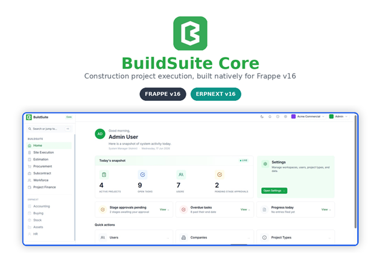

<div align="center">



# BuildSuite Core

A construction operating system built on Frappe

</div>

## Introduction

BuildSuite Core is an open-source Frappe application for construction and infrastructure project delivery — modeling recursive project hierarchies, work package and task execution, stage planning, and role-based site governance.

## How to Install

You can install this app using the [bench](https://github.com/frappe/bench) CLI:

```bash
# Fetch the app into your bench
bench get-app https://github.com/BuildSuite-io/buildsuite_core.git
bench setup requirements

# Install the app into your site
bench --site [your.site.name] install-app buildsuite_core

# Run migrations
bench --site [your.site.name] migrate

# Build frontend assets (Vue bundle)
bench build --app buildsuite_core

# Restart bench
bench restart
```

### Prerequisites

- A working Frappe Framework v16 bench.
- ERPNext installed on the target site (BuildSuite Core extends the standard ERPNext Company DocType with custom fields).

### Dependencies

- Frappe
- ERPNext

## What We Covered

### What Ships as UI in M1

As a first step, we have integrated the **Site Execution Workspace**, bringing Projects, Sub-Projects, Work Packages, Tasks, Task Progress Entries, Stage Planning, and Team-based access together under one role-based workspace — excluding Scheduler, BOQ, and Scope Change Order, which are planned for a later milestone.

The home page currently shows a greeting and role-based shortcuts, but the page itself is still a placeholder and not yet wired to live data — full integration is planned for the next milestone.

### Core Execution Engine

- **Project** — the top-level container for a construction or infrastructure job.
- **Sub-Project** — a Project can contain child Projects, nested to any depth. Deleting a Project deletes its sub-tree too.
- **Work Package** — groups Tasks under a Project or Sub-Project, if any.
- **Task** — Types: Activity, Milestone, or Inspection.
- **Task Progress Entry** — logs field progress; the parent Task's progress and status update automatically.
- **Stage Planning** — the schedule layer, auto-created from project templates.
- **Attachments** — on Projects (using Frappe's built-in file support).
- **Team** — assigns users to a Project, controlling who has access to it.

> To set clear expectations, any reports currently visible within the Site Execution workspace — including those under Project Overview or surfaced elsewhere in the module — are placeholder displays only and have not yet been built out as part of this milestone's scope; full reporting functionality is planned for a later milestone.

### Project Templates

Three ready-made templates — **Commercial**, **Residential**, **Infrastructure**. Picking one auto-creates the default schedule (Stage Planning) for that project. A UI for building custom templates is not part of this milestone.

### Settings

Within Settings, only the user list and details have been implemented so far, giving administrators a central place to view and manage the users who have access to the system.

### Multi-Company Support

Projects belong to a Company. If you run a single company, you won't even see this field. If you run multiple companies, users only see data for the companies they're allowed to access.

### Roles & Permissions

Twelve user roles, including a top-level BuildSuite Administrator role. Permissions control what each role can see and do — for example, a Project Manager only sees their own projects.

- **Director / Owner** — full visibility across every workspace; company leadership view.
- **Project Manager (PM)** — owns assigned projects end-to-end; approves spend in Procurement, Subcontract, and Workforce; full Site Execution and Project Finance access.
- **Estimator** — owns the Estimation workspace (BOQ, Rate Master); read-only on Site Execution.
- **Quantity Surveyor (QS)** — full access to Estimation and Subcontract (measurement and billing); read-only on Project Finance.
- **Site Engineer** — handles on-site execution; full Site Execution and Workforce access; can raise Material Requests.
- **Foreman / Supervisor** — logs field-level task progress and crew assignments; create-only on Site Execution.
- **Procurement Officer** — manages the Procurement workspace end-to-end (Material Requests, supplier follow-up, GRN).
- **Store Keeper** — manages Stock; read-only on Procurement and Buying.
- **Accountant** — owns Project Finance and Accounting; pay-only access on Subcontract and Workforce.
- **HR Manager** — owns the HR workspace; self-service access elsewhere.
- **System Manager (Admin)** — full technical administrator access across the entire site.
- **BuildSuite Administrator** — the customer's top-level BuildSuite product owner, sitting above System Manager.

## Contributing

### Prerequisites

This is a Frappe **v16** app. You need a bench with this app installed plus a test
site (the examples below use `bs.local`). Runtimes are pinned by Frappe v16:
**Python 3.14** and **Node ≥ 24**.

### Frontend

The Vue 3 SPA lives in [`frontend/`](frontend/) and is served by Frappe at `/core`.
See [`frontend/README.md`](frontend/README.md) for dev / build / test, and
[`frontend/DEVELOPER_GUIDE.md`](frontend/DEVELOPER_GUIDE.md) for the frontend
architecture and feature-building patterns (data adapter, Desk primitives,
permissions, routing).

### Local dev gate

All checks that CI runs are mirrored by a `Makefile` so you can run them before
pushing. From the app directory (`apps/buildsuite_core`):

```bash
make setup     # one-time: install pre-commit + semgrep (isolated) and wire the git hook
make check     # the full gate: lint + semgrep + backend tests
make lint      # ruff (lint + format + import sort), prettier, eslint
make semgrep   # Frappe semgrep rules + python correctness rules
make test      # bench run-tests --app buildsuite_core   (override: make test SITE=mysite)
make e2e       # build the frontend + run Cypress  (see note below)
```

> **Install pre-commit in isolation — never `pip install pre-commit` inside the
> bench venv.** pre-commit pulls in `virtualenv`, which requires a newer
> `filelock` than Frappe's pin (`~=3.20.1`), and the two cannot coexist. Use
> [`pipx`](https://pipx.pypa.io/) (what `make setup` does) or a dedicated venv.

Once `pre-commit install` has run, **ruff / prettier / eslint run automatically on
every commit** against your staged files. To run them manually: `pre-commit run
--all-files` (or `make lint`). Configured tools: `ruff`, `eslint`, `prettier`.

### Running the tests

```bash
# backend (Frappe test runner)
bench --site bs.local set-config allow_tests true
bench --site bs.local run-tests --app buildsuite_core

# frontend e2e (Cypress, real backend) — needs `bench start` running and the
# persona test users provisioned first:
bench --site bs.local execute buildsuite_core.api.cypress_setup.ensure_cypress_users
cd frontend && yarn test          # headless;  yarn test:open for the GUI runner
```

`make test` / `make e2e` wrap the above. The Cypress suite points at the Frappe
server (default `http://localhost:8001`; override with `CYPRESS_BASE_URL`) and
needs the frontend **built** (`yarn build`) so Frappe serves the current bundle.

### Commit conventions

Single-sentence, semantic commit messages (`fix:`, `test:`, `chore:`, `docs:`),
split per area of change. No co-author trailers.

## CI

GitHub Actions workflows (`.github/workflows/`):

- **CI** (`ci.yml`) — spins up a fresh bench, installs this app, and runs the
  backend test suite. Triggers on pushes to `develop` / `main` / `version-16` and
  on every pull request.
- **Linters** (`linter.yml`) — runs the pre-commit hooks, the
  [Frappe Semgrep Rules](https://github.com/frappe/semgrep-rules), and
  [pip-audit](https://pypi.org/project/pip-audit/) on every pull request.

Running `make check` locally reproduces the CI gate before you push.

## License

mit
